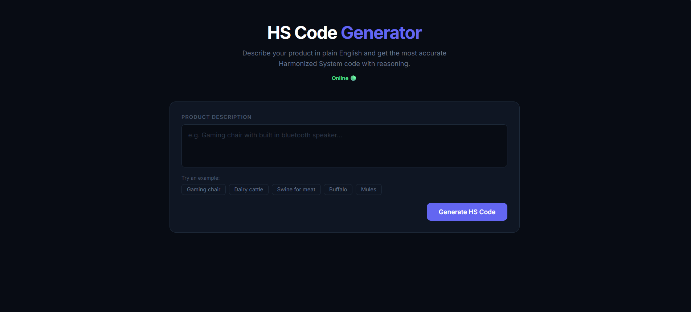
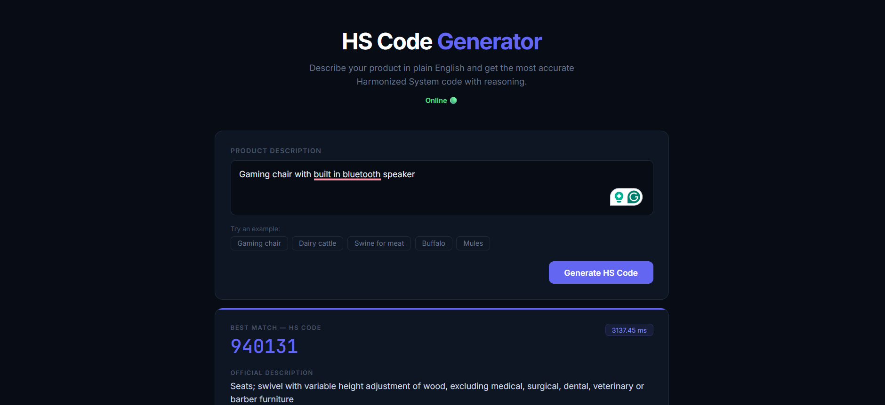
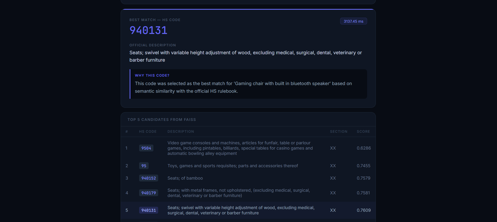

# 🔍 HS Code Generator

> AI-powered Harmonized System code classifier — describe your product in plain English, get the right HS code instantly.



---

## ✨ Features

- 🧠 **Semantic Search** — FAISS + Qwen3 embeddings find the closest matching HS codes
- 🤖 **LLM Reasoning** — LLaMA 3.2 (4-bit) picks the best match and explains why
- ⚡ **Fast** — quantized model runs locally, no API calls
- 🖥️ **Clean UI** — minimal dark-mode frontend built with TypeScript + Vite

---

## 📸 Screenshots

| Search | Result | Candidates |
|--------|--------|------------|
|  |  |  |

---

## 🛠️ Tech Stack

| Layer | Tech |
|-------|------|
| Backend | Python, FastAPI |
| Vector Search | FAISS, LangChain |
| Embedding Model | `Qwen3-Embedding-0.6B` (CPU) |
| LLM | `llama-3.2-1b-Instruct` 4-bit (GPU) |
| Frontend | TypeScript, Vite |

---

## 🚀 Getting Started

### 1. Add your data

Place your HS codes CSV in:

```
input/harmonized-system.csv
```

Expected columns: `hscode`, `description`, `parent`, `section`, `level`

### 2. Build the FAISS index

```bash
cd code/backend
pip install -r requirements.txt
python ../../scripts/ingest.py
```

### 3. Start the backend

```bash
uvicorn main:app --port 8000
```

### 4. Start the frontend

```bash
cd code/frontend
npm install
npm run dev
```

Then open `http://localhost:5173`

---

## 📁 Project Structure

```
hs-generator/
├── input/                  # Put your CSV here
├── output/                 # FAISS index (auto-generated)
├── code/
│   ├── backend/
│   │   ├── main.py         # FastAPI server
│   │   ├── hs_engine.py    # LLM inference
│   │   ├── vector_store.py # FAISS + embeddings
│   │   └── csv_loader.py   # CSV reader
│   └── frontend/
│       └── src/            # TypeScript + Vite
└── scripts/
    └── ingest.py           # Index builder
```

---

## 📄 License

Personal project — for learning and experimentation.
